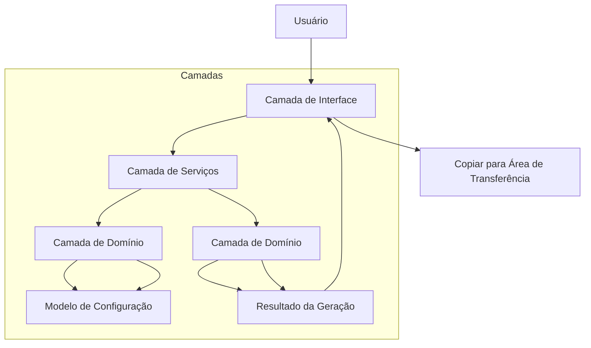

```mermaid
flowchart TD
    A[Usuário] --> B[Interface Streamlit]
    B --> C[Serviços]
    C --> D[Validação de Regras]
    C --> E[Geração da Senha]
    D --> F[Configuração da Senha]
    E --> G[Senha Gerada]
    G --> B
    B --> H[Copiar para Área de Transferência]

    subgraph Camadas
        B[Camada de Interface]
        C[Camada de Serviços]
        D[Camada de Domínio]
        E[Camada de Domínio]
        F[Modelo de Configuração]
        G[Resultado da Geração]
    end

    D --> F
    E --> G
```
